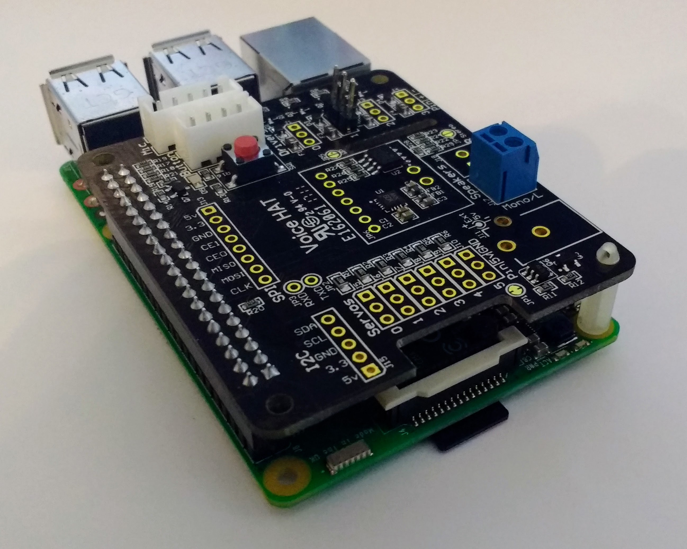
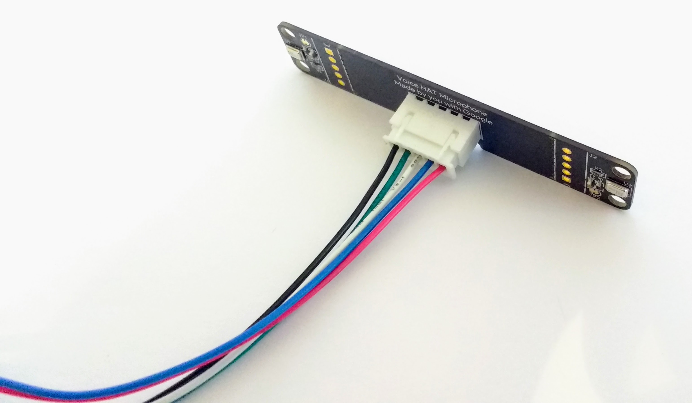
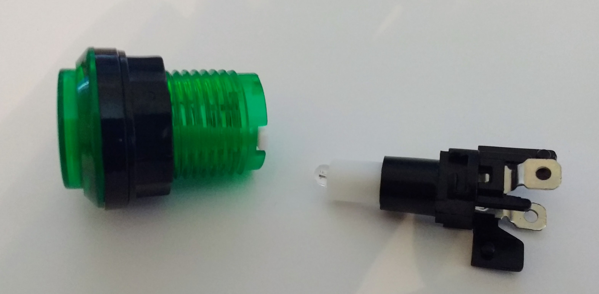
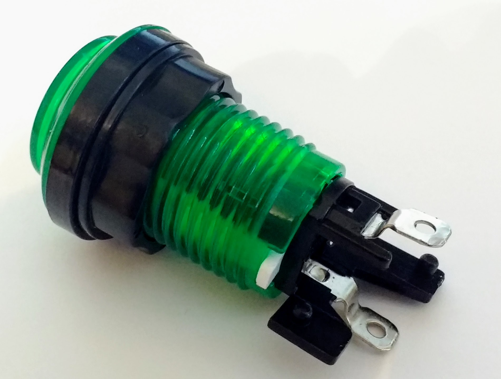
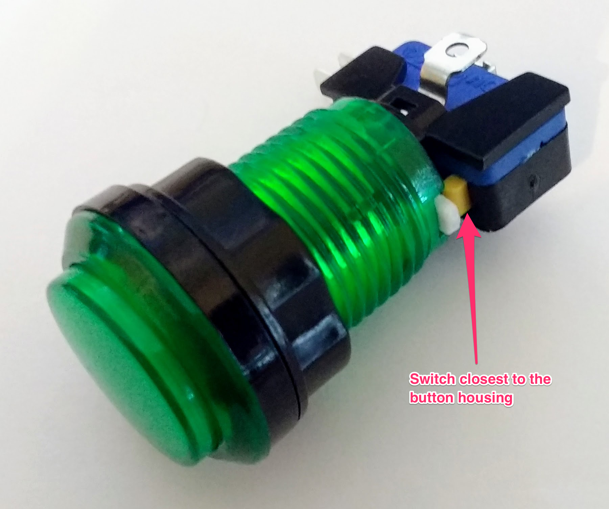
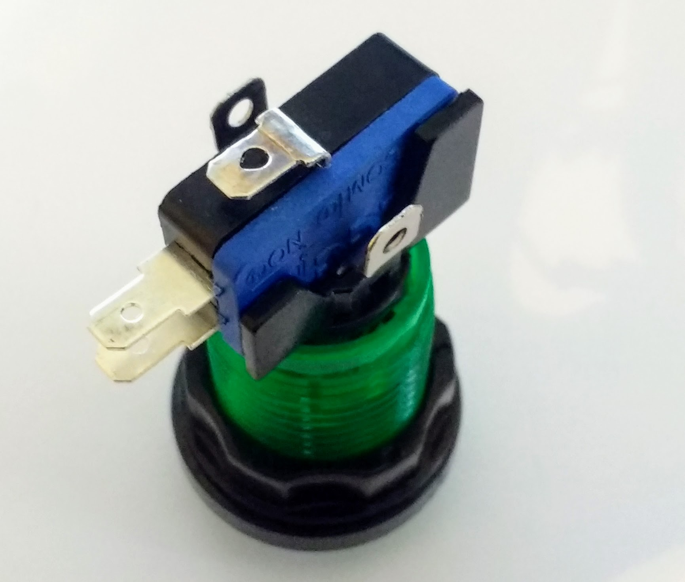
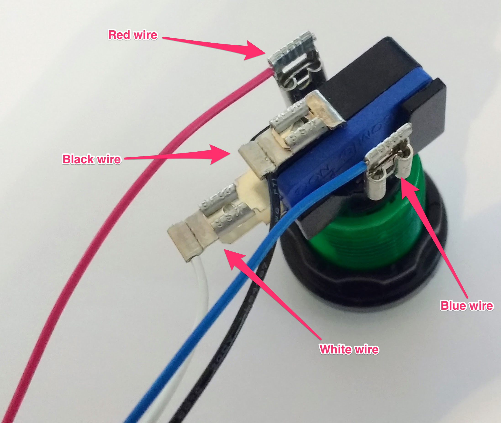
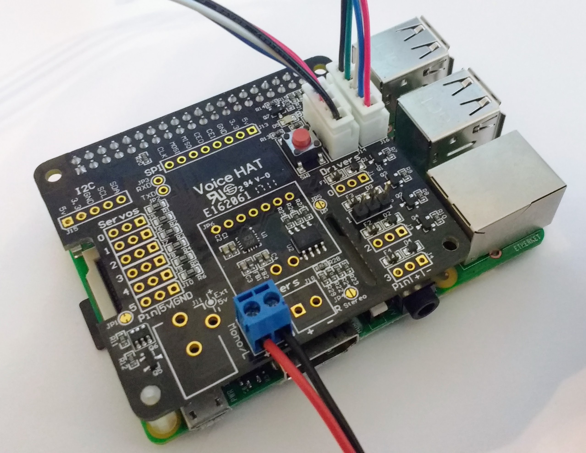

- To begin you need to use the plastic **standoffs** to help support the Voice Kit HAT when it is attached to the Raspberry Pi. Insert the standoffs into the mounting holes opposite the GPIO pins.

	

- You can now place the HAT onto the Raspberry Pi - make sure that the pins are all aligned.

	

- Next, attach the speaker to the kit. It has to be wired in a particular way: the red wire needs to be inserted into the hole closest to the Raspberry Pi's Ethernet port. The black wire goes into the other hole. Use a Phillips-head screwdriver to secure the wires in place.

	

- Now it's time to connect the microphone to its leads. The connectors only fit one way, so this shouldn't be too difficult.

	

- The trickiest part is assembling the button. You'll need the button and the LED housing to begin with.

	

- Insert the LED housing into the button, and then twist it to secure it in place.

	

- Then the switch needs attaching. This can be awkward. The holes of the switch need to align with the pegs on the LED housing. Just make sure that the small button (here, it is yellow) is positioned closest to the button.

	

- Now you can attach the leads to the button.

	

- Attach the leads as shown in the image below.

	

- To finish, attach the microphone and the button to the HAT as shown.

	
